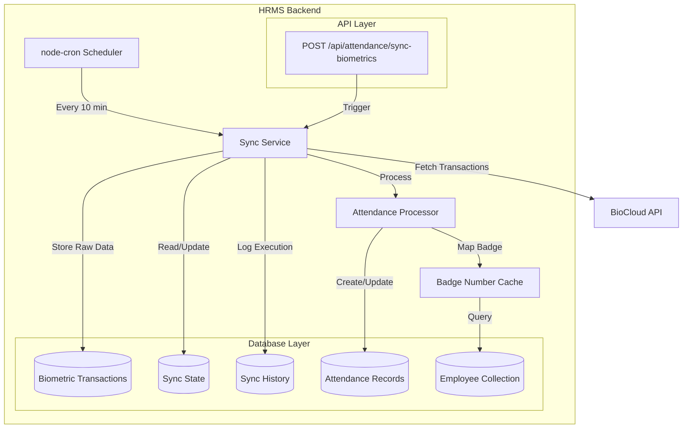
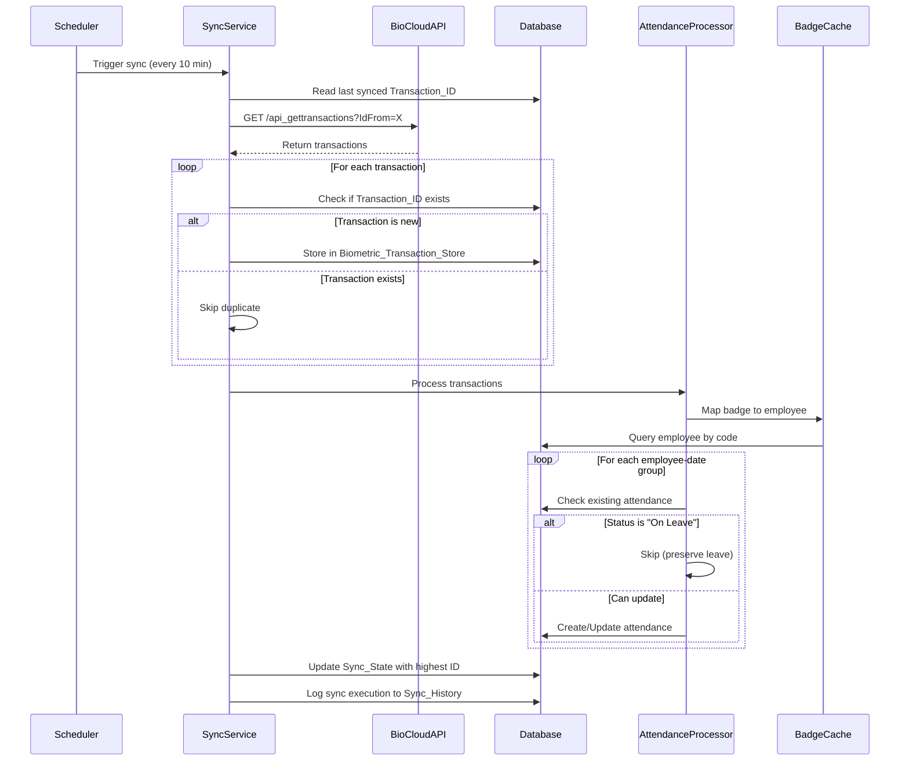
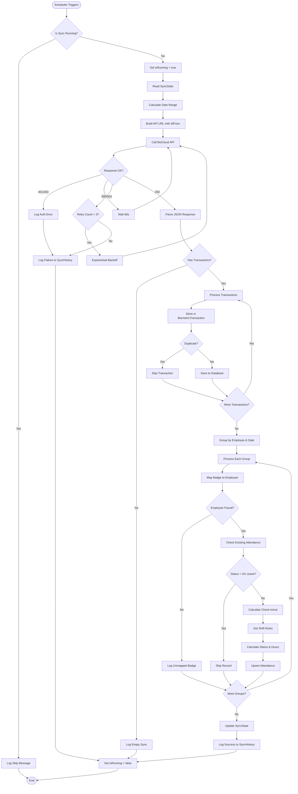

# Design Document: BioCloud Biometric Integration System

## Overview

The BioCloud Biometric Integration System is a scheduled synchronization service that automatically fetches employee attendance data from the BioCloud biometric device API and processes it into the existing HRMS attendance system. The system operates as a background service within the Node.js/Express backend, executing every 10 minutes to maintain up-to-date attendance records.

### Key Design Goals

1. **Automated Synchronization**: Eliminate manual data entry by automatically fetching biometric transactions every 10 minutes
2. **Incremental Sync**: Use the IdFrom parameter to fetch only new transactions, avoiding duplicate processing
3. **Data Integrity**: Maintain a complete audit trail of raw biometric data while preventing duplicate records
4. **Resilience**: Handle API failures gracefully with retry logic and proper error handling
5. **Observability**: Provide comprehensive logging and monitoring for troubleshooting and system health tracking
6. **Configurability**: Allow system administrators to adjust sync parameters through environment variables

### System Context

The integration operates within the existing HRMS backend system:
- **Runtime**: Node.js/Express application
- **Database**: MongoDB (Mongoose ODM)
- **Scheduling**: node-cron for periodic execution
- **External API**: BioCloud API at https://15.biocloud.me:8205
- **Existing Components**: Employee management, attendance tracking, shift configuration


## Architecture

### High-Level Architecture



### Component Interaction Flow




### Architectural Decisions

#### 1. Scheduling Mechanism: node-cron

**Decision**: Use node-cron for scheduling instead of external cron jobs or task queues.

**Rationale**:
- Already available in Node.js ecosystem
- Simple configuration and management
- Runs within the application process (no external dependencies)
- Sufficient for 10-minute interval requirements
- Easy to disable/enable programmatically

**Trade-offs**:
- Requires application to be running continuously
- No built-in distributed scheduling (single instance only)
- For production with multiple instances, consider using a distributed lock or leader election

#### 2. Incremental Sync Strategy

**Decision**: Use IdFrom parameter with persistent state tracking.

**Rationale**:
- Minimizes API payload size
- Reduces processing overhead
- Prevents duplicate transaction processing
- Aligns with BioCloud API design

**Implementation**:
- Store last synced Transaction_ID in database
- Pass as IdFrom parameter on next sync
- Update after successful processing

#### 3. Two-Phase Processing

**Decision**: Separate raw data storage from attendance processing.

**Rationale**:
- Complete audit trail of all biometric events
- Ability to reprocess data if business logic changes
- Debugging and troubleshooting capability
- Data integrity verification


#### 4. Badge Number Caching

**Decision**: Implement in-memory cache with 60-minute TTL for badge-to-employee mappings.

**Rationale**:
- Reduces database queries during sync operations
- Badge numbers rarely change
- 60-minute refresh balances freshness with performance
- Simple Map-based implementation

**Cache Invalidation**:
- Time-based: Refresh every 60 minutes
- Event-based: Clear on employee code updates (future enhancement)

## Components and Interfaces

### 1. Sync Service Component

**Responsibility**: Orchestrate the biometric data synchronization workflow.

**Location**: `backend/src/services/biometricSyncService.js`

**Key Functions**:

```javascript
class BiometricSyncService {
  /**
   * Execute the complete sync workflow
   * @returns {Promise<SyncResult>} Sync execution results
   */
  async executeSyncJob()
  
  /**
   * Fetch transactions from BioCloud API
   * @param {number} idFrom - Last synced transaction ID
   * @param {string} startDate - Start date (YYYY-MM-DD)
   * @param {string} endDate - End date (YYYY-MM-DD)
   * @returns {Promise<Transaction[]>} Array of transactions
   */
  async fetchTransactions(idFrom, startDate, endDate)
  
  /**
   * Store raw transactions in database
   * @param {Transaction[]} transactions - Transactions to store
   * @returns {Promise<number>} Count of stored transactions
   */
  async storeTransactions(transactions)
  
  /**
   * Update sync state with latest transaction ID
   * @param {number} transactionId - Highest transaction ID processed
   * @returns {Promise<void>}
   */
  async updateSyncState(transactionId)
}
```


**Configuration**:
```javascript
{
  apiUrl: process.env.BIOCLOUD_API_URL || 'https://15.biocloud.me:8205',
  apiToken: process.env.BIOCLOUD_API_TOKEN,
  syncInterval: process.env.BIOCLOUD_SYNC_INTERVAL || 10,
  retryAttempts: process.env.BIOCLOUD_RETRY_ATTEMPTS || 3,
  dateRangeDays: process.env.BIOCLOUD_DATE_RANGE_DAYS || 7
}
```

**Dependencies**:
- node-fetch (HTTP client)
- BiometricTransaction model
- SyncState model
- SyncHistory model
- AttendanceProcessor

### 2. Attendance Processor Component

**Responsibility**: Transform raw biometric transactions into attendance records.

**Location**: `backend/src/services/attendanceProcessor.js`

**Key Functions**:

```javascript
class AttendanceProcessor {
  /**
   * Process transactions into attendance records
   * @param {Transaction[]} transactions - Raw biometric transactions
   * @returns {Promise<ProcessingResult>} Processing statistics
   */
  async processTransactions(transactions)
  
  /**
   * Group transactions by employee and date
   * @param {Transaction[]} transactions - Raw transactions
   * @returns {Map<string, GroupedTransaction>} Grouped by "employeeId_date"
   */
  groupTransactionsByEmployeeAndDate(transactions)
  
  /**
   * Map badge number to employee ID
   * @param {string} badgeNumber - Employee badge number
   * @returns {Promise<ObjectId|null>} Employee ID or null
   */
  async mapBadgeToEmployee(badgeNumber)
  
  /**
   * Create or update attendance record
   * @param {string} employeeId - Employee ID
   * @param {string} date - Date (YYYY-MM-DD)
   * @param {string} checkIn - Check-in time (HH:MM)
   * @param {string} checkOut - Check-out time (HH:MM)
   * @returns {Promise<Attendance>} Created/updated attendance record
   */
  async upsertAttendance(employeeId, date, checkIn, checkOut)
}
```


**Processing Logic**:
1. Group transactions by employee and date
2. For each group:
   - Find earliest IN transaction → check-in time
   - Find latest OUT transaction → check-out time
   - Map badge number to employee ID using cache
   - Query existing attendance record
   - Skip if status is "On Leave"
   - Calculate work hours using shift rules
   - Determine status (Present/Late/Absent) based on shift configuration
   - Upsert attendance record only if times differ

**Dependencies**:
- Employee model
- Attendance model
- Master model (for shift rules)
- BadgeNumberCache

### 3. Badge Number Cache Component

**Responsibility**: Maintain in-memory cache of badge number to employee ID mappings.

**Location**: `backend/src/services/badgeNumberCache.js`

**Implementation**:

```javascript
class BadgeNumberCache {
  constructor() {
    this.cache = new Map(); // badgeNumber -> { employeeId, timestamp }
    this.ttl = 60 * 60 * 1000; // 60 minutes in milliseconds
  }
  
  /**
   * Get employee ID for badge number
   * @param {string} badgeNumber - Badge number
   * @returns {Promise<ObjectId|null>} Employee ID or null
   */
  async get(badgeNumber)
  
  /**
   * Refresh cache from database
   * @returns {Promise<void>}
   */
  async refresh()
  
  /**
   * Check if cache needs refresh
   * @returns {boolean} True if cache is stale
   */
  isStale()
  
  /**
   * Clear cache
   */
  clear()
}
```


**Cache Strategy**:
- Load all employee code-to-ID mappings on first access
- Refresh every 60 minutes automatically
- Return null for unmapped badge numbers (log warning)

### 4. Scheduler Component

**Responsibility**: Trigger sync operations at configured intervals.

**Location**: `backend/src/schedulers/biometricScheduler.js`

**Implementation**:

```javascript
import cron from 'node-cron';
import BiometricSyncService from '../services/biometricSyncService.js';

class BiometricScheduler {
  constructor() {
    this.syncService = new BiometricSyncService();
    this.task = null;
    this.isRunning = false;
  }
  
  /**
   * Start the scheduler
   */
  start() {
    const interval = process.env.BIOCLOUD_SYNC_INTERVAL || 10;
    const cronExpression = `*/${interval} * * * *`; // Every N minutes
    
    this.task = cron.schedule(cronExpression, async () => {
      if (this.isRunning) {
        console.log('[Biometric Scheduler] Previous sync still running, skipping...');
        return;
      }
      
      this.isRunning = true;
      try {
        await this.syncService.executeSyncJob();
      } catch (error) {
        console.error('[Biometric Scheduler] Sync failed:', error);
      } finally {
        this.isRunning = false;
      }
    });
    
    console.log(`[Biometric Scheduler] Started with ${interval}-minute interval`);
  }
  
  /**
   * Stop the scheduler
   */
  stop() {
    if (this.task) {
      this.task.stop();
      console.log('[Biometric Scheduler] Stopped');
    }
  }
}

export default new BiometricScheduler();
```


### 5. API Controller Component

**Responsibility**: Expose manual sync endpoint for on-demand synchronization.

**Location**: `backend/src/controllers/biometricSyncController.js`

**Endpoint Specification**:

```javascript
/**
 * POST /api/attendance/sync-biometrics
 * Manually trigger biometric data synchronization
 * 
 * Request Body (optional):
 * {
 *   "startDate": "2024-01-01",  // Optional: Override default date range
 *   "endDate": "2024-01-07"     // Optional: Override default date range
 * }
 * 
 * Response:
 * {
 *   "success": true,
 *   "message": "Sync completed successfully",
 *   "data": {
 *     "transactionsFetched": 150,
 *     "transactionsStored": 145,
 *     "recordsCreated": 50,
 *     "recordsUpdated": 30,
 *     "recordsSkipped": 20,
 *     "errors": [],
 *     "duration": 2500
 *   }
 * }
 * 
 * Authorization: Requires "MANAGE_ATTENDANCE" permission or "Admin" role
 */
export const manualSync = async (req, res) => {
  // Implementation details in controller
}
```

**Queue Management**:
- Check if automatic sync is running
- Queue manual sync request if needed
- Return immediate response with job ID
- Client can poll for completion status (future enhancement)


## Data Models

### 1. BiometricTransaction Model

**Purpose**: Store raw biometric transaction data for audit trail and reprocessing.

**Schema**:

```javascript
import mongoose from 'mongoose';

const biometricTransactionSchema = new mongoose.Schema({
  transactionId: {
    type: Number,
    required: true,
    unique: true,
    index: true
  },
  
  badgeNumber: {
    type: String,
    required: true,
    index: true
  },
  
  timestamp: {
    type: Date,
    required: true,
    index: true
  },
  
  transactionType: {
    type: String,
    enum: ['IN', 'OUT'],
    required: true
  },
  
  deviceId: {
    type: String,
    default: null
  },
  
  syncedAt: {
    type: Date,
    default: Date.now,
    index: true
  },
  
  processed: {
    type: Boolean,
    default: false,
    index: true
  },
  
  processedAt: {
    type: Date,
    default: null
  },
  
  rawData: {
    type: mongoose.Schema.Types.Mixed,
    default: {}
  }
}, {
  timestamps: true
});

// Compound index for efficient querying
biometricTransactionSchema.index({ badgeNumber: 1, timestamp: 1 });
biometricTransactionSchema.index({ syncedAt: 1, processed: 1 });

export default mongoose.model('BiometricTransaction', biometricTransactionSchema);
```


**Field Descriptions**:
- `transactionId`: Unique ID from BioCloud API (Id field)
- `badgeNumber`: Employee badge number from API
- `timestamp`: Transaction timestamp from API
- `transactionType`: IN or OUT punch type
- `deviceId`: Biometric device identifier (if provided by API)
- `syncedAt`: When this transaction was fetched from API
- `processed`: Whether this transaction has been processed into attendance
- `processedAt`: When this transaction was processed
- `rawData`: Complete raw JSON response from API for debugging

**Indexes**:
- `transactionId`: Unique index for duplicate detection
- `badgeNumber`: For employee-specific queries
- `timestamp`: For date range queries
- `syncedAt`: For sync history analysis
- `(badgeNumber, timestamp)`: Compound index for efficient processing queries
- `(syncedAt, processed)`: For reprocessing unprocessed transactions

### 2. SyncState Model

**Purpose**: Track the last successfully synced transaction ID for incremental sync.

**Schema**:

```javascript
import mongoose from 'mongoose';

const syncStateSchema = new mongoose.Schema({
  key: {
    type: String,
    required: true,
    unique: true,
    default: 'biocloud_sync'
  },
  
  lastSyncedTransactionId: {
    type: Number,
    required: true,
    default: 0
  },
  
  lastSyncTimestamp: {
    type: Date,
    required: true,
    default: Date.now
  },
  
  lastSuccessfulSync: {
    type: Date,
    default: null
  },
  
  consecutiveFailures: {
    type: Number,
    default: 0
  }
}, {
  timestamps: true
});

export default mongoose.model('SyncState', syncStateSchema);
```


**Field Descriptions**:
- `key`: Singleton key (always 'biocloud_sync')
- `lastSyncedTransactionId`: Highest transaction ID successfully processed
- `lastSyncTimestamp`: Timestamp of last sync attempt
- `lastSuccessfulSync`: Timestamp of last successful sync
- `consecutiveFailures`: Count of consecutive failures (reset on success)

**Singleton Pattern**:
- Only one document exists with key='biocloud_sync'
- Use `findOneAndUpdate` with upsert for atomic updates
- Initialize with transactionId=0 on first run

### 3. SyncHistory Model

**Purpose**: Maintain detailed log of all sync executions for monitoring and troubleshooting.

**Schema**:

```javascript
import mongoose from 'mongoose';

const syncHistorySchema = new mongoose.Schema({
  syncType: {
    type: String,
    enum: ['SCHEDULED', 'MANUAL'],
    required: true
  },
  
  startTime: {
    type: Date,
    required: true,
    index: true
  },
  
  endTime: {
    type: Date,
    default: null
  },
  
  status: {
    type: String,
    enum: ['SUCCESS', 'PARTIAL_SUCCESS', 'FAILED'],
    required: true,
    index: true
  },
  
  transactionsFetched: {
    type: Number,
    default: 0
  },
  
  transactionsStored: {
    type: Number,
    default: 0
  },
  
  recordsCreated: {
    type: Number,
    default: 0
  },
  
  recordsUpdated: {
    type: Number,
    default: 0
  },
  
  recordsSkipped: {
    type: Number,
    default: 0
  },
  
  unmappedBadges: {
    type: [String],
    default: []
  },
  
  errorMessage: {
    type: String,
    default: null
  },
  
  errorStack: {
    type: String,
    default: null
  },
  
  triggeredBy: {
    type: mongoose.Schema.Types.ObjectId,
    ref: 'User',
    default: null
  }
}, {
  timestamps: true
});

syncHistorySchema.index({ startTime: -1 });
syncHistorySchema.index({ status: 1, startTime: -1 });

export default mongoose.model('SyncHistory', syncHistorySchema);
```


**Field Descriptions**:
- `syncType`: Whether sync was scheduled or manually triggered
- `startTime`: When sync execution started
- `endTime`: When sync execution completed
- `status`: Overall sync result
- `transactionsFetched`: Count of transactions returned by API
- `transactionsStored`: Count of new transactions stored (excluding duplicates)
- `recordsCreated`: Count of new attendance records created
- `recordsUpdated`: Count of existing attendance records updated
- `recordsSkipped`: Count of records skipped (e.g., on leave status)
- `unmappedBadges`: List of badge numbers without employee mapping
- `errorMessage`: Error message if sync failed
- `errorStack`: Full error stack trace for debugging
- `triggeredBy`: User ID if manually triggered

**Retention Policy**:
- Keep last 90 days of history
- Archive older records to separate collection (future enhancement)

### 4. Attendance Model (Existing - No Changes)

The existing Attendance model will be used without modifications. The biometric sync will create/update records using the existing schema:

```javascript
{
  employee: ObjectId,
  date: String,        // YYYY-MM-DD
  shift: String,
  checkIn: String,     // HH:MM
  checkOut: String,    // HH:MM
  workHours: String,   // "8h 45m"
  status: String,      // Present, Late, Absent, On Leave
  lateTier: Number,
  // ... other existing fields
}
```

**Integration Points**:
- Biometric sync will NOT overwrite records with status "On Leave"
- Work hours calculated using existing shift rules from Master collection
- Status determination uses existing late tier logic


## API Specifications

### BioCloud API Integration

**Endpoint**: `GET https://15.biocloud.me:8205/api_gettransactions`

**Request Headers**:
```
BioCloudAPIAuthorization: d168b9ea529a4b44a8419e499fe16f3e
Content-Type: application/json
```

**Query Parameters**:
| Parameter | Type | Required | Description |
|-----------|------|----------|-------------|
| BadgeNumber | string | No | Employee badge number (null for all employees) |
| IdFrom | number | No | Fetch transactions with ID greater than this value |
| StartDate | string | No | Start date in YYYY-MM-DD format |
| EndDate | string | No | End date in YYYY-MM-DD format |

**Example Request**:
```
GET https://15.biocloud.me:8205/api_gettransactions?BadgeNumber=null&IdFrom=12345&StartDate=2024-01-01&EndDate=2024-01-08
Headers:
  BioCloudAPIAuthorization: d168b9ea529a4b44a8419e499fe16f3e
```

**Response Format**:
```json
{
  "success": true,
  "data": [
    {
      "Id": 12346,
      "BadgeNumber": "EMP001",
      "Timestamp": "2024-01-08T08:45:00Z",
      "Type": "IN",
      "DeviceId": "DEVICE_01"
    },
    {
      "Id": 12347,
      "BadgeNumber": "EMP001",
      "Timestamp": "2024-01-08T17:30:00Z",
      "Type": "OUT",
      "DeviceId": "DEVICE_01"
    }
  ],
  "count": 2
}
```

**Error Responses**:
- `401 Unauthorized`: Invalid or missing authorization token
- `403 Forbidden`: Insufficient permissions
- `429 Too Many Requests`: Rate limit exceeded
- `500 Internal Server Error`: Server-side error
- `503 Service Unavailable`: Service temporarily unavailable


### HRMS Manual Sync API

**Endpoint**: `POST /api/attendance/sync-biometrics`

**Authentication**: Required (JWT token)

**Authorization**: User must have `MANAGE_ATTENDANCE` permission or `Admin` role

**Request Body** (optional):
```json
{
  "startDate": "2024-01-01",
  "endDate": "2024-01-08"
}
```

**Success Response** (200 OK):
```json
{
  "success": true,
  "message": "Sync completed successfully",
  "data": {
    "transactionsFetched": 150,
    "transactionsStored": 145,
    "recordsCreated": 50,
    "recordsUpdated": 30,
    "recordsSkipped": 20,
    "unmappedBadges": ["BADGE123", "BADGE456"],
    "errors": [],
    "duration": 2500,
    "syncHistoryId": "507f1f77bcf86cd799439011"
  }
}
```

**Error Responses**:

**401 Unauthorized**:
```json
{
  "success": false,
  "message": "Authentication required"
}
```

**403 Forbidden**:
```json
{
  "success": false,
  "message": "Insufficient permissions. MANAGE_ATTENDANCE permission required."
}
```

**409 Conflict** (sync already running):
```json
{
  "success": false,
  "message": "Sync operation already in progress. Please try again later.",
  "data": {
    "currentSyncStarted": "2024-01-08T10:30:00Z"
  }
}
```

**500 Internal Server Error**:
```json
{
  "success": false,
  "message": "Sync operation failed",
  "error": "Error message details"
}
```


## Scheduling Mechanism

### node-cron Configuration

**Installation**:
```bash
npm install node-cron
```

**Cron Expression Format**:
```
*    *    *    *    *
┬    ┬    ┬    ┬    ┬
│    │    │    │    │
│    │    │    │    └─── Day of Week (0-7, 0 and 7 are Sunday)
│    │    │    └──────── Month (1-12)
│    │    └───────────── Day of Month (1-31)
│    └────────────────── Hour (0-23)
└─────────────────────── Minute (0-59)
```

**Implementation**:

For 10-minute interval:
```javascript
const cronExpression = '*/10 * * * *'; // Every 10 minutes
```

For configurable interval from environment:
```javascript
const interval = process.env.BIOCLOUD_SYNC_INTERVAL || 10;
const cronExpression = `*/${interval} * * * *`;
```

**Scheduler Lifecycle**:

1. **Application Startup** (`backend/src/server.js`):
```javascript
import biometricScheduler from './schedulers/biometricScheduler.js';

// After database connection
connectDB().then(() => {
  // Start biometric sync scheduler
  biometricScheduler.start();
  
  // Start Express server
  app.listen(PORT, () => {
    console.log(`Server running on port ${PORT}`);
  });
});
```

2. **Graceful Shutdown**:
```javascript
process.on('SIGTERM', () => {
  console.log('SIGTERM received, shutting down gracefully...');
  biometricScheduler.stop();
  process.exit(0);
});

process.on('SIGINT', () => {
  console.log('SIGINT received, shutting down gracefully...');
  biometricScheduler.stop();
  process.exit(0);
});
```


### Concurrency Control

**Problem**: Prevent overlapping sync executions when previous sync takes longer than interval.

**Solution**: Use a simple flag-based lock:

```javascript
class BiometricScheduler {
  constructor() {
    this.isRunning = false;
  }
  
  start() {
    this.task = cron.schedule(cronExpression, async () => {
      if (this.isRunning) {
        console.log('[Scheduler] Previous sync still running, skipping...');
        return;
      }
      
      this.isRunning = true;
      try {
        await this.syncService.executeSyncJob();
      } finally {
        this.isRunning = false;
      }
    });
  }
}
```

**For Multi-Instance Deployments** (future enhancement):
- Use distributed lock (Redis, MongoDB)
- Implement leader election
- Or designate single instance for scheduled jobs

## Error Handling and Retry Logic

### Retry Strategy

**Exponential Backoff Configuration**:

```javascript
const RETRY_CONFIG = {
  maxAttempts: parseInt(process.env.BIOCLOUD_RETRY_ATTEMPTS) || 3,
  delays: [5000, 15000, 45000], // 5s, 15s, 45s in milliseconds
  retryableStatusCodes: [500, 503, 504],
  nonRetryableStatusCodes: [401, 403]
};
```

**Retry Implementation**:

```javascript
async function fetchWithRetry(url, options, attempt = 1) {
  try {
    const response = await fetch(url, options);
    
    // Non-retryable errors
    if (RETRY_CONFIG.nonRetryableStatusCodes.includes(response.status)) {
      throw new Error(`Non-retryable error: ${response.status}`);
    }
    
    // Rate limiting
    if (response.status === 429) {
      console.log('[Retry] Rate limited, waiting 60 seconds...');
      await sleep(60000);
      return fetchWithRetry(url, options, attempt);
    }
    
    // Retryable errors
    if (RETRY_CONFIG.retryableStatusCodes.includes(response.status)) {
      if (attempt < RETRY_CONFIG.maxAttempts) {
        const delay = RETRY_CONFIG.delays[attempt - 1];
        console.log(`[Retry] Attempt ${attempt} failed, retrying in ${delay}ms...`);
        await sleep(delay);
        return fetchWithRetry(url, options, attempt + 1);
      }
      throw new Error(`Max retry attempts reached: ${response.status}`);
    }
    
    return response;
  } catch (error) {
    // Network errors
    if (attempt < RETRY_CONFIG.maxAttempts && error.code === 'ECONNREFUSED') {
      const delay = RETRY_CONFIG.delays[attempt - 1];
      console.log(`[Retry] Network error, retrying in ${delay}ms...`);
      await sleep(delay);
      return fetchWithRetry(url, options, attempt + 1);
    }
    throw error;
  }
}
```


### Error Categories and Handling

#### 1. Authentication Errors (401, 403)

**Handling**:
- Log error with full details
- Do NOT retry
- Update SyncState with failure
- Send alert notification (future enhancement)

```javascript
if (response.status === 401 || response.status === 403) {
  console.error('[BioCloud API] Authentication failed:', {
    status: response.status,
    message: await response.text()
  });
  
  await SyncHistory.create({
    syncType: 'SCHEDULED',
    startTime: syncStartTime,
    endTime: new Date(),
    status: 'FAILED',
    errorMessage: 'Authentication failed with BioCloud API'
  });
  
  throw new Error('Authentication failed - check BIOCLOUD_API_TOKEN');
}
```

#### 2. Rate Limiting (429)

**Handling**:
- Wait 60 seconds
- Retry once
- If still rate limited, fail and log

```javascript
if (response.status === 429) {
  console.warn('[BioCloud API] Rate limited, waiting 60 seconds...');
  await sleep(60000);
  // Retry logic continues
}
```

#### 3. Server Errors (500, 503)

**Handling**:
- Retry up to 3 times with exponential backoff
- Log each attempt
- If all retries fail, log and continue to next scheduled execution

#### 4. Network Errors

**Handling**:
- Retry up to 3 times with exponential backoff
- Log connection details
- Check if API endpoint is reachable

```javascript
catch (error) {
  if (error.code === 'ECONNREFUSED' || error.code === 'ETIMEDOUT') {
    console.error('[BioCloud API] Network error:', {
      code: error.code,
      message: error.message,
      endpoint: BIOCLOUD_API_URL
    });
    // Retry logic
  }
}
```


#### 5. Malformed JSON Response

**Handling**:
- Log raw response body
- Do NOT retry
- Mark sync as failed
- Continue to next scheduled execution

```javascript
try {
  const data = await response.json();
} catch (parseError) {
  console.error('[BioCloud API] JSON parse error:', {
    error: parseError.message,
    responseText: await response.text()
  });
  
  await SyncHistory.create({
    syncType: 'SCHEDULED',
    startTime: syncStartTime,
    endTime: new Date(),
    status: 'FAILED',
    errorMessage: 'Invalid JSON response from BioCloud API',
    errorStack: parseError.stack
  });
  
  return; // Skip this sync cycle
}
```

#### 6. Database Errors

**Handling**:
- Log error with full context
- Attempt to rollback partial changes if possible
- Mark sync as failed
- Do NOT retry (database issues need manual intervention)

```javascript
try {
  await BiometricTransaction.create(transaction);
} catch (dbError) {
  console.error('[Database] Error storing transaction:', {
    transactionId: transaction.transactionId,
    error: dbError.message,
    code: dbError.code
  });
  
  // Continue processing other transactions
  // Log to sync history
}
```

#### 7. Unmapped Badge Numbers

**Handling**:
- Log warning with badge number and timestamp
- Add to unmappedBadges array in SyncHistory
- Continue processing other transactions
- Do NOT fail entire sync

```javascript
const employeeId = await badgeCache.get(badgeNumber);
if (!employeeId) {
  console.warn('[Badge Mapping] Unmapped badge number:', {
    badgeNumber,
    timestamp: transaction.timestamp
  });
  
  unmappedBadges.push(badgeNumber);
  continue; // Skip this transaction
}
```


### Error Recovery

**Sync State Recovery**:
- If sync fails, SyncState is NOT updated
- Next sync will retry from last successful transaction ID
- Prevents data loss during failures

**Partial Success Handling**:
- If some transactions process successfully but others fail
- Update SyncState with highest successfully processed ID
- Mark sync as PARTIAL_SUCCESS in SyncHistory
- Failed transactions will be retried in next sync

**Consecutive Failure Tracking**:
```javascript
// In SyncState model
consecutiveFailures: {
  type: Number,
  default: 0
}

// After sync failure
await SyncState.findOneAndUpdate(
  { key: 'biocloud_sync' },
  { $inc: { consecutiveFailures: 1 } }
);

// After sync success
await SyncState.findOneAndUpdate(
  { key: 'biocloud_sync' },
  { consecutiveFailures: 0 }
);

// Alert if threshold exceeded
if (syncState.consecutiveFailures >= 5) {
  // Send alert notification
  console.error('[Alert] 5 consecutive sync failures detected');
}
```

## Data Flow

### Complete Sync Flow Diagram




### Transaction Processing Flow

**Step-by-Step Processing**:

1. **Fetch Transactions**:
   - Read last synced ID from SyncState
   - Calculate date range (default: 7 days back to today)
   - Build API URL with parameters
   - Execute HTTP request with retry logic
   - Parse JSON response

2. **Store Raw Transactions**:
   ```javascript
   for (const txn of transactions) {
     try {
       await BiometricTransaction.create({
         transactionId: txn.Id,
         badgeNumber: txn.BadgeNumber,
         timestamp: new Date(txn.Timestamp),
         transactionType: txn.Type,
         deviceId: txn.DeviceId,
         rawData: txn
       });
       storedCount++;
     } catch (error) {
       if (error.code === 11000) {
         // Duplicate key - skip
         duplicateCount++;
       } else {
         throw error;
       }
     }
   }
   ```

3. **Group Transactions**:
   ```javascript
   const grouped = new Map();
   
   for (const txn of transactions) {
     const date = txn.timestamp.toISOString().split('T')[0];
     const key = `${txn.badgeNumber}_${date}`;
     
     if (!grouped.has(key)) {
       grouped.set(key, {
         badgeNumber: txn.badgeNumber,
         date,
         checkIn: null,
         checkOut: null,
         transactions: []
       });
     }
     
     const group = grouped.get(key);
     group.transactions.push(txn);
     
     if (txn.transactionType === 'IN') {
       const time = txn.timestamp.toTimeString().substring(0, 5);
       if (!group.checkIn || time < group.checkIn) {
         group.checkIn = time;
       }
     } else if (txn.transactionType === 'OUT') {
       const time = txn.timestamp.toTimeString().substring(0, 5);
       if (!group.checkOut || time > group.checkOut) {
         group.checkOut = time;
       }
     }
   }
   ```


4. **Process Each Group**:
   ```javascript
   for (const [key, group] of grouped) {
     // Map badge to employee
     const employeeId = await badgeCache.get(group.badgeNumber);
     if (!employeeId) {
       unmappedBadges.push(group.badgeNumber);
       continue;
     }
     
     // Check existing attendance
     const existing = await Attendance.findOne({
       employee: employeeId,
       date: group.date
     });
     
     // Skip if on leave
     if (existing && existing.status === 'On Leave') {
       skippedCount++;
       continue;
     }
     
     // Get employee shift
     const employee = await Employee.findById(employeeId);
     const shiftName = employee.shift || 'Day Shift';
     
     // Get shift rules
     const shiftRules = await getShiftRules(shiftName);
     
     // Calculate status
     let status = 'Absent';
     let lateTier = 0;
     if (group.checkIn) {
       lateTier = calculateLateTier(group.checkIn, shiftRules);
       status = lateTier > 0 ? 'Late' : 'Present';
     }
     
     // Calculate work hours
     const workHours = calculateDuration(group.checkIn, group.checkOut);
     
     // Upsert attendance
     const result = await Attendance.findOneAndUpdate(
       { employee: employeeId, date: group.date },
       {
         employee: employeeId,
         date: group.date,
         shift: shiftName,
         checkIn: group.checkIn,
         checkOut: group.checkOut,
         status,
         lateTier,
         workHours
       },
       { upsert: true, new: true }
     );
     
     if (result.isNew) {
       createdCount++;
     } else {
       updatedCount++;
     }
   }
   ```

5. **Update Sync State**:
   ```javascript
   const highestId = Math.max(...transactions.map(t => t.Id));
   
   await SyncState.findOneAndUpdate(
     { key: 'biocloud_sync' },
     {
       lastSyncedTransactionId: highestId,
       lastSyncTimestamp: new Date(),
       lastSuccessfulSync: new Date(),
       consecutiveFailures: 0
     },
     { upsert: true }
   );
   ```


6. **Log Sync History**:
   ```javascript
   await SyncHistory.create({
     syncType: isManual ? 'MANUAL' : 'SCHEDULED',
     startTime: syncStartTime,
     endTime: new Date(),
     status: 'SUCCESS',
     transactionsFetched: transactions.length,
     transactionsStored: storedCount,
     recordsCreated: createdCount,
     recordsUpdated: updatedCount,
     recordsSkipped: skippedCount,
     unmappedBadges: unmappedBadges,
     triggeredBy: userId // if manual
   });
   ```

## Testing Strategy

### Unit Tests

**Test Coverage Areas**:

1. **BiometricSyncService**:
   - Fetch transactions with various parameters
   - Handle API errors and retries
   - Store transactions with duplicate detection
   - Update sync state correctly

2. **AttendanceProcessor**:
   - Group transactions by employee and date
   - Calculate earliest check-in and latest check-out
   - Map badge numbers to employees
   - Handle unmapped badges
   - Skip records with "On Leave" status
   - Calculate work hours correctly
   - Determine status based on shift rules

3. **BadgeNumberCache**:
   - Load cache from database
   - Return cached values
   - Refresh on TTL expiration
   - Handle cache misses

4. **BiometricScheduler**:
   - Start and stop scheduler
   - Prevent concurrent executions
   - Handle errors gracefully

**Example Unit Test**:
```javascript
describe('AttendanceProcessor', () => {
  describe('groupTransactionsByEmployeeAndDate', () => {
    it('should group multiple IN/OUT transactions correctly', () => {
      const transactions = [
        { badgeNumber: 'EMP001', timestamp: '2024-01-08T08:45:00Z', type: 'IN' },
        { badgeNumber: 'EMP001', timestamp: '2024-01-08T09:00:00Z', type: 'IN' },
        { badgeNumber: 'EMP001', timestamp: '2024-01-08T17:30:00Z', type: 'OUT' },
        { badgeNumber: 'EMP001', timestamp: '2024-01-08T17:45:00Z', type: 'OUT' }
      ];
      
      const grouped = processor.groupTransactionsByEmployeeAndDate(transactions);
      
      expect(grouped.size).toBe(1);
      expect(grouped.get('EMP001_2024-01-08').checkIn).toBe('08:45');
      expect(grouped.get('EMP001_2024-01-08').checkOut).toBe('17:45');
    });
  });
});
```


### Integration Tests

**Test Scenarios**:

1. **End-to-End Sync Flow**:
   - Mock BioCloud API responses
   - Verify transactions stored in database
   - Verify attendance records created
   - Verify sync state updated

2. **API Error Handling**:
   - Test retry logic with 500 errors
   - Test rate limiting with 429 errors
   - Test authentication failures with 401 errors
   - Test network errors

3. **Manual Sync Endpoint**:
   - Test successful manual sync
   - Test authorization checks
   - Test concurrent sync prevention
   - Test custom date range parameters

4. **Badge Mapping**:
   - Test successful mapping
   - Test unmapped badge handling
   - Test cache refresh

5. **Leave Status Protection**:
   - Verify records with "On Leave" status are not overwritten
   - Verify other statuses can be updated

**Example Integration Test**:
```javascript
describe('Biometric Sync Integration', () => {
  it('should sync transactions and create attendance records', async () => {
    // Setup: Create test employee
    const employee = await Employee.create({
      code: 'EMP001',
      name: 'Test Employee',
      shift: 'Day Shift'
    });
    
    // Mock BioCloud API
    nock('https://15.biocloud.me:8205')
      .get('/api_gettransactions')
      .query(true)
      .reply(200, {
        success: true,
        data: [
          { Id: 1, BadgeNumber: 'EMP001', Timestamp: '2024-01-08T08:45:00Z', Type: 'IN' },
          { Id: 2, BadgeNumber: 'EMP001', Timestamp: '2024-01-08T17:30:00Z', Type: 'OUT' }
        ]
      });
    
    // Execute sync
    const result = await syncService.executeSyncJob();
    
    // Verify results
    expect(result.transactionsFetched).toBe(2);
    expect(result.transactionsStored).toBe(2);
    expect(result.recordsCreated).toBe(1);
    
    // Verify database
    const transactions = await BiometricTransaction.find();
    expect(transactions).toHaveLength(2);
    
    const attendance = await Attendance.findOne({ employee: employee._id });
    expect(attendance.checkIn).toBe('08:45');
    expect(attendance.checkOut).toBe('17:30');
    expect(attendance.status).toBe('Present');
  });
});
```


### Manual Testing Checklist

**Pre-Deployment Testing**:

- [ ] Verify environment variables are configured
- [ ] Test initial sync with IdFrom=0
- [ ] Test incremental sync with existing state
- [ ] Test manual sync endpoint with valid credentials
- [ ] Test manual sync endpoint with invalid credentials
- [ ] Test concurrent sync prevention
- [ ] Verify transactions stored in database
- [ ] Verify attendance records created correctly
- [ ] Verify "On Leave" status protection
- [ ] Test unmapped badge number handling
- [ ] Test API authentication failure
- [ ] Test API rate limiting
- [ ] Test API server error with retry
- [ ] Test network error with retry
- [ ] Verify sync history logging
- [ ] Verify scheduler starts on application startup
- [ ] Verify scheduler stops on graceful shutdown
- [ ] Test with custom date range parameters
- [ ] Verify work hours calculation
- [ ] Verify status determination (Present/Late)

**Production Monitoring**:

- [ ] Monitor sync execution frequency
- [ ] Monitor sync success/failure rates
- [ ] Monitor unmapped badge numbers
- [ ] Monitor API response times
- [ ] Monitor database performance
- [ ] Check sync history for errors
- [ ] Verify attendance data accuracy

## Configuration Management

### Environment Variables

**Required Variables**:

```bash
# BioCloud API Configuration
BIOCLOUD_API_URL=https://15.biocloud.me:8205
BIOCLOUD_API_TOKEN=d168b9ea529a4b44a8419e499fe16f3e

# Sync Configuration
BIOCLOUD_SYNC_INTERVAL=10          # Minutes between syncs
BIOCLOUD_RETRY_ATTEMPTS=3          # Number of retry attempts
BIOCLOUD_DATE_RANGE_DAYS=7         # Days to look back for transactions

# Database Configuration (existing)
DB_URL=mongodb://localhost:27017/hrms
```


**Configuration Validation**:

```javascript
class ConfigValidator {
  static validate() {
    const errors = [];
    
    if (!process.env.BIOCLOUD_API_TOKEN) {
      errors.push('BIOCLOUD_API_TOKEN is required');
    }
    
    const interval = parseInt(process.env.BIOCLOUD_SYNC_INTERVAL);
    if (interval && (interval < 1 || interval > 60)) {
      errors.push('BIOCLOUD_SYNC_INTERVAL must be between 1 and 60 minutes');
    }
    
    const retryAttempts = parseInt(process.env.BIOCLOUD_RETRY_ATTEMPTS);
    if (retryAttempts && (retryAttempts < 0 || retryAttempts > 10)) {
      errors.push('BIOCLOUD_RETRY_ATTEMPTS must be between 0 and 10');
    }
    
    const dateRangeDays = parseInt(process.env.BIOCLOUD_DATE_RANGE_DAYS);
    if (dateRangeDays && (dateRangeDays < 1 || dateRangeDays > 90)) {
      errors.push('BIOCLOUD_DATE_RANGE_DAYS must be between 1 and 90');
    }
    
    if (errors.length > 0) {
      console.error('[Config] Validation errors:', errors);
      throw new Error('Configuration validation failed');
    }
    
    console.log('[Config] Validation passed');
  }
}

// Call during application startup
ConfigValidator.validate();
```

**Default Values**:

```javascript
const config = {
  apiUrl: process.env.BIOCLOUD_API_URL || 'https://15.biocloud.me:8205',
  apiToken: process.env.BIOCLOUD_API_TOKEN, // No default - required
  syncInterval: parseInt(process.env.BIOCLOUD_SYNC_INTERVAL) || 10,
  retryAttempts: parseInt(process.env.BIOCLOUD_RETRY_ATTEMPTS) || 3,
  dateRangeDays: parseInt(process.env.BIOCLOUD_DATE_RANGE_DAYS) || 7
};
```

**Configuration Logging**:

```javascript
console.log('[Config] Biometric Sync Configuration:', {
  apiUrl: config.apiUrl,
  apiToken: config.apiToken ? '***' + config.apiToken.slice(-4) : 'NOT SET',
  syncInterval: config.syncInterval,
  retryAttempts: config.retryAttempts,
  dateRangeDays: config.dateRangeDays
});
```


## Logging and Monitoring

### Logging Strategy

**Log Levels**:
- **INFO**: Normal operations (sync start, sync complete, transactions processed)
- **WARN**: Non-critical issues (unmapped badges, skipped records, rate limiting)
- **ERROR**: Failures requiring attention (API errors, database errors, authentication failures)

**Structured Logging Format**:

```javascript
const logger = {
  info: (message, data = {}) => {
    console.log(JSON.stringify({
      level: 'INFO',
      timestamp: new Date().toISOString(),
      component: 'BiometricSync',
      message,
      ...data
    }));
  },
  
  warn: (message, data = {}) => {
    console.warn(JSON.stringify({
      level: 'WARN',
      timestamp: new Date().toISOString(),
      component: 'BiometricSync',
      message,
      ...data
    }));
  },
  
  error: (message, error, data = {}) => {
    console.error(JSON.stringify({
      level: 'ERROR',
      timestamp: new Date().toISOString(),
      component: 'BiometricSync',
      message,
      error: {
        message: error.message,
        stack: error.stack,
        code: error.code
      },
      ...data
    }));
  }
};
```

**Key Log Points**:

1. **Sync Start**:
```javascript
logger.info('Sync job started', {
  syncType: 'SCHEDULED',
  lastSyncedId: syncState.lastSyncedTransactionId,
  dateRange: { startDate, endDate }
});
```

2. **API Request**:
```javascript
logger.info('Calling BioCloud API', {
  url: apiUrl,
  params: { IdFrom, StartDate, EndDate }
});
```

3. **API Response**:
```javascript
logger.info('BioCloud API response received', {
  status: response.status,
  transactionCount: data.length,
  duration: Date.now() - startTime
});
```

4. **Transaction Storage**:
```javascript
logger.info('Transactions stored', {
  fetched: transactions.length,
  stored: storedCount,
  duplicates: duplicateCount
});
```


5. **Unmapped Badge**:
```javascript
logger.warn('Unmapped badge number encountered', {
  badgeNumber,
  timestamp: transaction.timestamp,
  transactionId: transaction.transactionId
});
```

6. **Attendance Processing**:
```javascript
logger.info('Attendance records processed', {
  created: createdCount,
  updated: updatedCount,
  skipped: skippedCount,
  unmappedBadges: unmappedBadges.length
});
```

7. **Sync Complete**:
```javascript
logger.info('Sync job completed', {
  status: 'SUCCESS',
  duration: Date.now() - syncStartTime,
  transactionsFetched: transactions.length,
  recordsCreated: createdCount,
  recordsUpdated: updatedCount
});
```

8. **Error Logging**:
```javascript
logger.error('Sync job failed', error, {
  syncType: 'SCHEDULED',
  lastSyncedId: syncState.lastSyncedTransactionId,
  retryAttempt: currentAttempt
});
```

### Monitoring Metrics

**Key Metrics to Track**:

1. **Sync Execution Metrics**:
   - Sync frequency (should match configured interval)
   - Sync duration (average, p95, p99)
   - Success rate (percentage)
   - Consecutive failure count

2. **Data Volume Metrics**:
   - Transactions fetched per sync
   - Transactions stored per sync
   - Attendance records created per sync
   - Attendance records updated per sync

3. **Error Metrics**:
   - API error rate by status code
   - Retry count per sync
   - Unmapped badge count
   - Database error count

4. **Performance Metrics**:
   - API response time
   - Database query time
   - Total sync duration
   - Cache hit rate


**Monitoring Dashboard Queries**:

```javascript
// Recent sync history
db.synchistories.find()
  .sort({ startTime: -1 })
  .limit(20);

// Failed syncs in last 24 hours
db.synchistories.find({
  status: 'FAILED',
  startTime: { $gte: new Date(Date.now() - 24*60*60*1000) }
});

// Unmapped badges in last 7 days
db.synchistories.aggregate([
  {
    $match: {
      startTime: { $gte: new Date(Date.now() - 7*24*60*60*1000) }
    }
  },
  {
    $unwind: '$unmappedBadges'
  },
  {
    $group: {
      _id: '$unmappedBadges',
      count: { $sum: 1 }
    }
  },
  {
    $sort: { count: -1 }
  }
]);

// Average sync duration
db.synchistories.aggregate([
  {
    $match: {
      status: 'SUCCESS',
      startTime: { $gte: new Date(Date.now() - 7*24*60*60*1000) }
    }
  },
  {
    $project: {
      duration: { $subtract: ['$endTime', '$startTime'] }
    }
  },
  {
    $group: {
      _id: null,
      avgDuration: { $avg: '$duration' },
      maxDuration: { $max: '$duration' },
      minDuration: { $min: '$duration' }
    }
  }
]);

// Sync success rate
db.synchistories.aggregate([
  {
    $match: {
      startTime: { $gte: new Date(Date.now() - 7*24*60*60*1000) }
    }
  },
  {
    $group: {
      _id: '$status',
      count: { $sum: 1 }
    }
  }
]);
```


### Alerting Rules

**Critical Alerts** (immediate action required):
- 5 consecutive sync failures
- Authentication failure (401/403)
- Database connection failure
- Sync duration exceeds 5 minutes

**Warning Alerts** (investigate within 24 hours):
- More than 10 unmapped badges in single sync
- Sync success rate below 95% over 24 hours
- API response time exceeds 10 seconds
- More than 50% of records skipped

**Alert Implementation** (future enhancement):
```javascript
async function checkAlertConditions(syncResult, syncState) {
  // Critical: Consecutive failures
  if (syncState.consecutiveFailures >= 5) {
    await sendAlert({
      level: 'CRITICAL',
      message: '5 consecutive sync failures detected',
      data: { consecutiveFailures: syncState.consecutiveFailures }
    });
  }
  
  // Warning: High unmapped badge count
  if (syncResult.unmappedBadges.length > 10) {
    await sendAlert({
      level: 'WARNING',
      message: 'High number of unmapped badges',
      data: { 
        count: syncResult.unmappedBadges.length,
        badges: syncResult.unmappedBadges
      }
    });
  }
  
  // Warning: High skip rate
  const totalRecords = syncResult.recordsCreated + syncResult.recordsUpdated + syncResult.recordsSkipped;
  const skipRate = syncResult.recordsSkipped / totalRecords;
  if (skipRate > 0.5) {
    await sendAlert({
      level: 'WARNING',
      message: 'High record skip rate',
      data: { 
        skipRate: (skipRate * 100).toFixed(2) + '%',
        skipped: syncResult.recordsSkipped,
        total: totalRecords
      }
    });
  }
}
```

## Security Considerations

### API Token Security

**Storage**:
- Store API token in environment variable only
- Never commit token to version control
- Use secrets management in production (AWS Secrets Manager, HashiCorp Vault)

**Rotation**:
- Plan for token rotation without downtime
- Support multiple tokens during rotation period
- Log token usage for audit


### Data Privacy

**Personal Data Handling**:
- Badge numbers are employee identifiers (personal data)
- Timestamps reveal employee location and work patterns
- Store only necessary data
- Implement data retention policy

**Access Control**:
- Manual sync endpoint requires authentication
- Requires MANAGE_ATTENDANCE permission or Admin role
- Audit all manual sync operations
- Log user who triggered manual sync

**Data Retention**:
- BiometricTransaction: Keep for 1 year (audit trail)
- SyncHistory: Keep for 90 days (operational monitoring)
- Implement automated cleanup jobs

### Network Security

**HTTPS Communication**:
- BioCloud API uses HTTPS (port 8205)
- Verify SSL certificates
- Handle certificate errors appropriately

**Firewall Rules**:
- Allow outbound HTTPS to 15.biocloud.me:8205
- No inbound connections required for sync
- Document network requirements

## Performance Optimization

### Database Indexing

**BiometricTransaction Indexes**:
```javascript
// Unique index for duplicate detection
{ transactionId: 1 } // unique

// Query by badge and date range
{ badgeNumber: 1, timestamp: 1 }

// Find unprocessed transactions
{ syncedAt: 1, processed: 1 }

// Cleanup old records
{ syncedAt: 1 }
```

**SyncHistory Indexes**:
```javascript
// Recent history queries
{ startTime: -1 }

// Filter by status
{ status: 1, startTime: -1 }
```

