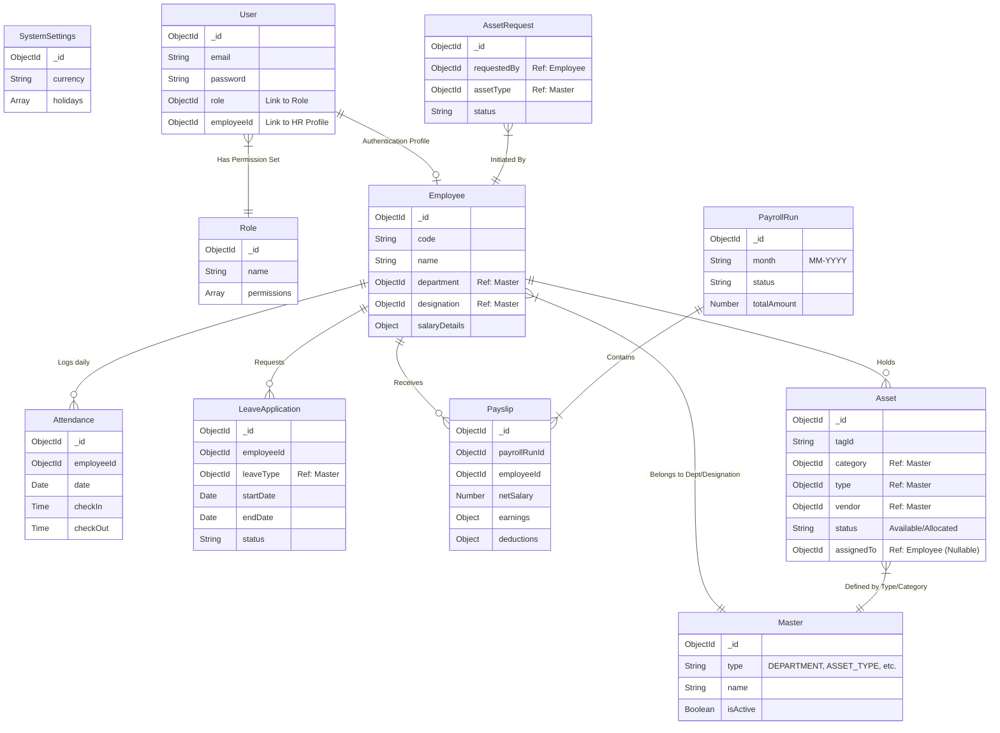

# Database Flow Diagram & Schema Overview

This chart represents the relationships between the unified `masters` collection and the transactional models (Employees, Assets, Payroll).

```mermaid
erDiagram
    %% --- Core Configuration ---
    Master {
        ObjectId _id
        String type "DEPARTMENT, ASSET_TYPE, etc."
        String name
        Boolean isActive
    }

    SystemSettings {
        ObjectId _id
        String currency
        Array holidays
    }

    %% --- Authentication ---
    User {
        ObjectId _id
        String email
        String password
        ObjectId role "Link to Role"
        ObjectId employeeId "Link to HR Profile"
    }
    
    Role {
        ObjectId _id
        String name
        Array permissions
    }

    %% --- HR Module ---
    Employee {
        ObjectId _id
        String code
        String name
        ObjectId department "Ref: Master"
        ObjectId designation "Ref: Master"
        Object salaryDetails
    }

    Attendance {
        ObjectId _id
        ObjectId employeeId
        Date date
        Time checkIn
        Time checkOut
    }

    LeaveApplication {
        ObjectId _id
        ObjectId employeeId
        ObjectId leaveType "Ref: Master"
        Date startDate
        Date endDate
        String status
    }

    %% --- Payroll Module ---
    PayrollRun {
        ObjectId _id
        String month "MM-YYYY"
        String status
        Number totalAmount
    }

    Payslip {
        ObjectId _id
        ObjectId payrollRunId
        ObjectId employeeId
        Number netSalary
        Object earnings
        Object deductions
    }

    %% --- Asset Module ---
    Asset {
        ObjectId _id
        String tagId
        ObjectId category "Ref: Master"
        ObjectId type "Ref: Master"
        ObjectId vendor "Ref: Master"
        String status "Available/Allocated"
        ObjectId assignedTo "Ref: Employee (Nullable)"
    }

    AssetRequest {
        ObjectId _id
        ObjectId requestedBy "Ref: Employee"
        ObjectId assetType "Ref: Master"
        String status
    }

    %% --- Relationships ---
    User ||--o| Employee : "Authentication Profile"
    User }|--|| Role : "Has Permission Set"
    
    Employee }|--|| Master : "Belongs to Dept/Designation"
    Employee ||--o{ Attendance : "Logs daily"
    Employee ||--o{ LeaveApplication : "Requests"
    Employee ||--o{ Payslip : "Receives"
    Employee ||--o{ Asset : "Holds"
    
    PayrollRun ||--|{ Payslip : "Contains"
    
    Asset }|--|| Master : "Defined by Type/Category"
    AssetRequest }|--|| Employee : "Initiated By"
```
